# 华中科技大学计算机科学与技术学院---《机器学习》结课报告
- 专业：计算机科学与技术
- 班级：CS2203班
- 学号：U202215418
- 姓名：陆继涛
- 成绩：
- 指导教师：何琨
- 完成日期：2024.5.18

---

- [华中科技大学计算机科学与技术学院 - 《机器学习》结课报告](#华中科技大学计算机科学与技术学院---《机器学习》结课报告)
  - [实验要求](#实验要求)
  - [算法设计与实现](#算法设计与实现)
    - [1.卷积层](#1.卷积层)
       - [1.1 卷积运算](#1.1卷积运算) 
       - [1.2 具体实现](#1.2具体实现)
    - [2.池化层](#2.池化层)
      - [2.1 最大池化](#2.1最大池化) 
    - [3. 激活函数、Softmax层、损失函数](#3.激活函数、Softmax层、损失函数)
       - [3.1 激活函数](#3.1激活函数)
       - [3.2 Softmax](#3.2Softmax)
       - [3.3 损失函数——交叉熵损失函数](#3.3损失函数——交叉熵损失函数)
    - [4. 全连接层](#4.全连接层)
       - [4.1 仿射变换](#4.1仿射变换)
       - [4.2 dropout](#4.2dropout)
       - [4.3 dropout在神经网络的使用](#4.3dropout在神经网络的使用)
        - [4.3.1 训练模型阶段](#4.3.1训练模型阶段)
        - [4.3.2 测试模型阶段](#4.3.2测试模型阶段)
    - [5. 反向传播](#5.反向传播)
       - [5.1 Softmax层](#5.1Softmax层)
       - [5.2 全连接层](#5.2全连接层)
       - [5.3 池化层](#5.3池化层)
       - [5.4 卷积层](#5.4卷积层)
	- [6. Batch Normalizaton](#6.BatchNormalizaton)
	   - [6.1Batch Normalizaton](#6.1BatchNormalizaton) 
	   - [6.2BN反向传播](#6.2BN反向传播)
  - [结果与分析](#结果与分析)
  - [个人体会](#个人体会)
  - [参考文献](#参考文献)
---

## 实验要求

总体要求：

1. 控制报告页数，不要大段大段贴代码
2. 表格和插图请编号并进行交叉引用，表格使用三线表

## 算法设计与实现

本次大作业选题为选题四：数字识别。本次项目利用卷积神经网络模型来实现手写数字识别，整体网络结构，采用2个卷积层、2个全连接层和1个输出层
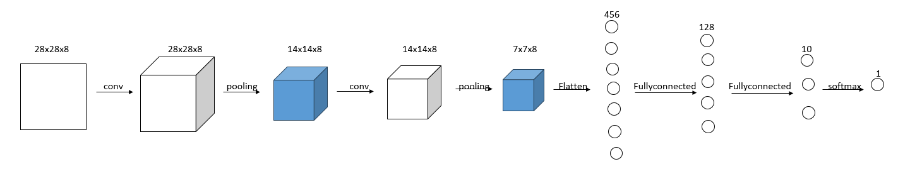

整个实现过程先后分为：卷积层、池化层、全连接层、softmax层的实现和反向传播。
在网络的优化过程中，先后尝试加入了**dropout**和**Batch Normalization**来加快训练速度和防止出现过拟合现象，两者均是位于全连接层激活函数之前。

### 1.卷积层
#### 1.1卷积运算
CNN 相较于 NN 来说主要是增加了基于 [convolution] 的卷积层，卷积层包含一组**filter**。
我们需要通过输入的图片和**filter**进行卷积操作，然后输出一张新的图片，包含以下步骤：
  1. 将**filter**叠加在图片的顶部，一般从左上角开始，然后执行对应元素的相乘；
  2. 将相乘的结果进行求和，得到输出图片的目标像素值；
  3. 重复以上操作，直到所有的位置。

同时考虑到，卷积后图片尺寸变小，我们加入了填充[Padding]，通过在周围补0实现输出前后图像大小一致。
对于实现的网络，我们将使用一个带有 8 个滤波器的小型卷积层作为网络的初始层。因此，经过这层卷积层处理后，$28\times 28$的输入图像将转换为$28\times 28 \times 8$的输出图像。
![[1.1.1.jpg#pic_center |图 1.1 第一层卷积层的运算过程 | 500]]
#### 1.2具体实现
首先，我们使用$3\times3$的**filter**，实现一个卷积层的类：
**Conv\_nxn\_** 类需要参数：**filter** 个数、**filter**的尺寸和**Padding**的大小。通过Numpy的randn()方法实现卷积层的初始化，同时除以9以防止初始化的值太大或者太小。
我们假设**filter**的个数为8：
				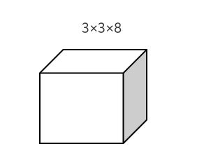
以下是具体实现卷积层：
首先，我们考虑输入为$28\times 28$的矩阵，卷积核的数量设置为8，此时我们可以得到26x26x8的输出，
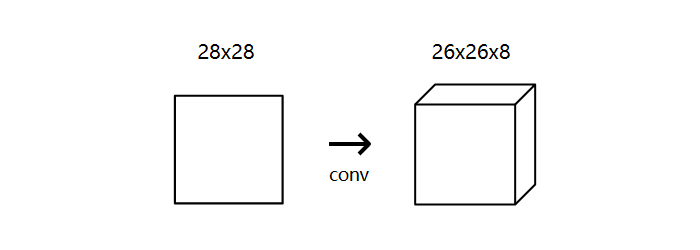
但是考虑到输入规模较小，因此在进行卷积运算前，对输入进行**Padding**，第一层的卷积层输出为$28\times 28 \times 8$的三维张量。
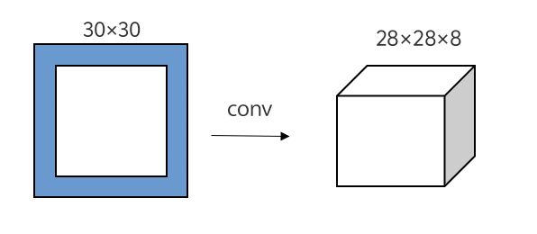

其次，在第二层的卷积层中，输入为$14 \times 14 \times 8$的三维张量，最开始时，我在之后的卷积层中将卷积核设置为三维张量，大小为$3 \times 3 \times depth$，其中，$depth$的大小与输入的深度相同，但是在实际运行中，发现模型的准确率不仅上升得很慢，而且还会出现先上升后下降的趋势，并且迭代次数越多，准确率越低，甚至出现了在10%上下波动的情况。

因此，考虑到在第一层时，尽管输入是相同的，但是每个卷积核所提取的特征图相互独立，所以，基于此想法，我们在之后的卷积运算中，尽可能使每一层的卷积运算相互独立，因此，将卷积核的大小设置为$3\times 3$的二维矩阵，每一个卷积核与某一层输入进行卷积运算，卷积核的数量与输入的深度保持一致。
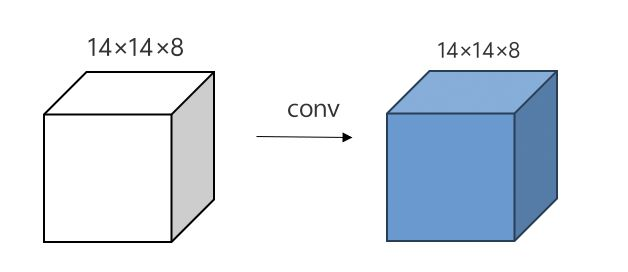

### 2.池化层
#### 2.1最大池化
图片的相邻像素具有相似的值，卷积层的很多信息是冗余的，因此通过池化来减少信息的冗余，其中有**max** 、**min** 、和 **average**。
我们选择基于$2\times 2$的**Max Pooling**。池化与卷积计算类似，计算最大值并赋值。
        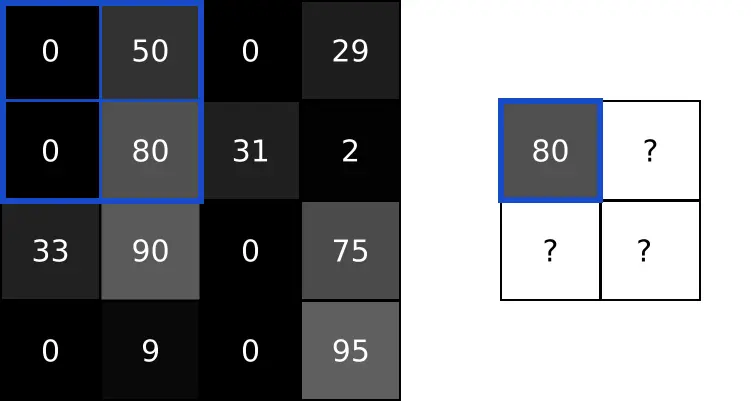
对于本项目，输入图像在经过初始层后，大小发生了$28 \times 28  \rightarrow 28 \times 28 \times 8 \rightarrow 14 \times 14 \times 8$的转变：
        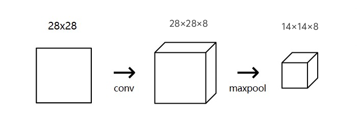

### 3.激活函数、Softmax层、损失函数
#### 3.1激活函数
参照AlexNet，我们选用ReLU函数作为激活函数，其中ReLU函数的表达式如下：
$\begin{align}ReLU(x) = {\begin{cases}x & x \geq 0 \\ 0 &x < 0 \end{cases}}\tag1\end{align}$ 。

#### 3.2Softmax
为了进行具体的预测，通过**Softmax**来实现，将一组数字转换为一组概率，总和为 1。
**Softmax**可以将任意实数值转换为概率，对于给定的数字$\{x_1, x_2, \cdots, x_i\}$：
    $\begin{align}s(x_i) = \frac{e^{x_i}}{\sum_{j=1}^n e^{x_j}}\tag2\end{align}$
    
**Softmax**变换的输出始终在范围内[0,1]加起来是 1。因此，它们形成**概率分布**。
最后，选择出概率最高的数字作为输出。

#### 3.3损失函数——交叉熵损失函数
**交叉熵损失函数(Cross-Entropy Loss)** 是用来计算概率间的距离，一般用来量化两个概率分布之间差异的损失函数（多用于分类问题）。
$\begin{align}H(p, q) = -\sum p(x) \ln (q(x)) \tag3\end{align}$
其中：
   1.  $p(x)$为真实概率；
   2.  $q(x)$为预测概率；
   3.  $H(p, q)$为预测结果与真实结果的差距。

在本项目中，对于真实概率，只有分类正确数字对应的概率为 1，其他均为 0，因此 交叉熵损失函数 可以写成如下形式：
$\begin{align}L= -\ln(p_c)\tag4\end{align}$
其中，*c*是正确分类，即正确的数字，$p_c$是*c*类的预测概率，$L$的值越小越好。

### 4.全连接层
全连接层，指的是每一个结点都有上一层的所有结点相连，用来将前面几层提取到的特征综合，并用当前层的神经元对其进行分类或回归。
首先，我们先将从卷积层输入的张量进行展平，其次，再对张量进行仿射变换，然后激活函数选择$ReLU(x)$函数，神经元的运算结果通过激活函数，最后，加入**dropout**层，随机的断开全连接层某些神经元的连接，通过不激活某些神经元的方式防止过拟合。

#### 4.1仿射变换
综上所述，全连接层实际上可以看成是对输入变量进行仿射变换：
$\begin{align}Y = \omega ^ T \ast X + b\tag5\end{align}$
其中：
   1.  $Y$为输出，即$output$；
   2.  $X$为输入，即$input$。
假设$X、W、B$分别是形状为(2,)、(2,3)、(3,)的多维数组。这样一 来，神经元的加权和可以用
$Y = np.dot(X, W) + B$计算出来。
        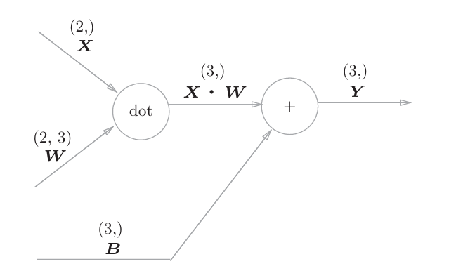

#### 4.2dropout
假设我们要训练这样一个神经网络，如图4.2.1所示。
				        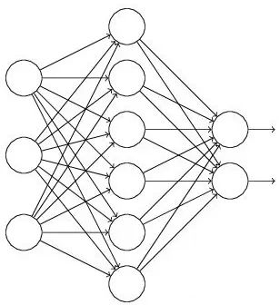

输入是$X$，输出是$Y$，正常的流程是：我们首先把$X$通过网络前向传播，然后把误差反向传播以决定如何更新参数让网络进行学习。使用**Dropout**之后，过程变成如下：
1.  首先随机（临时）删掉网络中一半的隐藏神经元，输入输出神经元保持不变（图4.2.2中虚线为部分临时被删除的神经元）
				        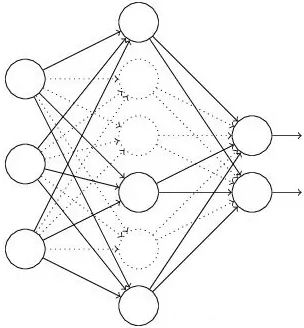

2. 然后把输入$X$通过修改后的网络前向传播，然后把得到的损失结果通过修改的网络反向传播。一小批训练样本执行完这个过程后，在没有被删除的神经元上按照随机梯度下降法更新对应的参数$(\omega, b)$。

3. 然后继续重复这一过程：
   - 恢复被删掉的神经元（此时被删除的神经元保持原样，而没有被删除的神经元已经有所更新）
   - 从隐藏层神经元中随机选择一个一半大小的子集临时删除掉（备份被删除神经元的参数）。
   - 对一小批训练样本，先前向传播然后反向传播损失并根据随机梯度下降法更新参数$(\omega, b)$
   - 没有被删除的那一部分参数得到更新，删除的神经元参数保持被删除前的结果。

#### 4.3dropout在神经网络的使用
下面，具体讲解一下Dropout代码层面的一些公式推导。

##### 4.3.1训练模型阶段

在训练网络的每个单元都要添加一道概率流程。
		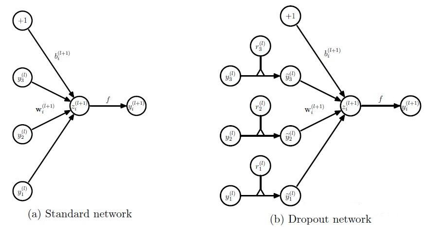

对应的公式变化如下：

- 没有Dropout的网络计算公式：
  $\begin{align} z_i^{(l+1)}  &= \omega_i ^ {(l+1)} y^{(l)} + b_i^{(l+1)} \tag6\\y_i^{(l+1)} &= f(z_i^{(l+1)}) \tag7\end{align}$

- 采用Dropout的网络计算公式：
  $\begin{align} r_j^{(l)} &\sim Bernoulli(p) \tag8\\ \overset{\sim}{y} ^{(l)} &= r ^{(l)} \ast y^{(l)}\tag9\\ z_i^{(l+1)} &= w_i^{(l+1)} \overset{\sim}{y}^{(l)} + b_i^{(l+1)} \tag{10}\\ y_i^{(l+1)} &= f(z_i^{(l+1)})\tag{11}\end{align}$
  
上面公式中$Bernoulli$函数是为了生成概率$r$向量，即随机生成一个0、1的向量。

代码层面实现让某个神经元以概率$p$停止工作，即使其激活函数值以概率$p$变为0。比如某一层网络神经元的个数为1000个，其激活函数输出值为$\{y_1, y_2, \cdots, y_{1000}\}$ ，**dropout比率**选择0.4，那么该层神经元经过**dropout**后，1000个神经元中会有大约400个的值被置为0。

经过上面屏蔽掉某些神经元，使其激活值为0以后，还需要对向量$\{y_1, y_2 ,\cdots, y_{1000}\}$进行缩放，即乘以$\frac{1}{1-p}$。如果在训练时，经过置0后，没有对$\{y_1, y_2 ,\cdots, y_{1000}\}$进行缩放(**rescale**)，那么在测试时，需要对权重进行缩放。

##### 4.3.2测试模型阶段

预测模型的时候，每一个神经单元的权重参数要乘以概率$p$。
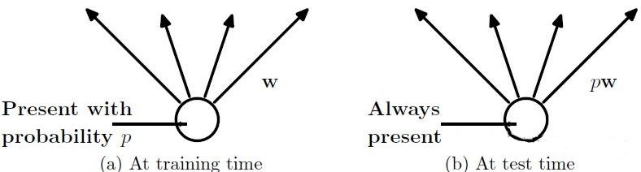

测试时**dropout**公式为：$w_{test}^{(l)} = pW^{(l)}$。

### 5.反向传播
反向传播的整个实现过程，从实际体验来看，属于是整个项目最复杂的部分。反向传播需要更新**gradient 和 weight**。我们可以采用以下两个方法：

- 在 **forward phase** 中，每一层都需要存储一些数据（例如输入数据，中间值等）。这些数据将会在 **backward phase** 中得到使用。因此每一个 **backward phase** 都需要在相应的 **forward phase** 之后运行。
- 在 **backward phase** 中，每一层都要获取 **gradient** 并且也返回 **gradient**。获取的是 **loss** 对于该层输出的 **gradient**$(\frac{\partial{L}}{\partial{out}})$，返回的是 **loss** 对于该层输入的 **gradient**$(\frac{\partial{L}}{\partial{in}})$ 。

#### 5.1Softmax层
首先，考虑到交叉熵损失函数：
$L = -\ln(p_c)$，其中，*c*是正确分类，即正确的数字，$p_c$是*c*类的预测概率。
不难算出，交叉熵函数的**gradient**:
$\begin{align}\frac{\partial{L}}{\partial{out(i)}} = {\begin{cases} 0 &if \ \ i \ne c \\ -\frac{1}{p_i}  &if \ \ i = c\end{cases}}\tag{12}\end{align}$
同时，该梯度也为**Softmax**层**backward phase**的输入。
假设**totals**为**softmax**转换前的值，即大小为10的向量，其中$t_i$表示**totals**的类$i$。
所以，
$\begin{align}out(c) = \frac{e^{t_c}}{\sum_{i} e^{t_i}} = \frac{e^{t_c}}{S}\tag{13}\end{align}$ 
其中， $S=\sum_i e^{t_i}$。

对于 $k \ne c$，$out(c) = e^{t_c}{S^{-1}}$， 由链式法则得：
$\begin{align} \frac{\partial{out(c)}}{\partial{t_k}}  & = \frac{\partial{out_s(c)})}{\partial{S}} (\frac{\partial{S}}{\partial{t_k}}) \\  & = -e^{t_c}S^{-2}(\frac{\partial{S}}{\partial{t_k}}) \\ &=-e^{t_c}S^{-2}(e^{t_k})  \\ &=\frac{-e^{t_c}e^{t_k}}{S^2} \tag{14}\end{align}$

     
对于$k=c$，
$\begin{align} \frac{\partial{out(c)}}{\partial{t_c}} &= \frac{Se^{t_c}-e^{t_c}\frac{\partial{S}}{\partial{t_c}}}{S^2} \\ & =\frac{Se^{t_c}-e^{t_c}e^{t_c}}{S^2} \\ & =\frac{e^{t_c}(S-e^{t_c})}{S^2} \tag{15}\end{align}$

综上： $\begin{align}\frac{\partial{out(c)}}{\partial{t_k}} =  \begin{cases} \frac{-e^{t_c}e^{t_k}}{S^2}  & if \ \  k \neq c  \\ \frac{e^{t_c}(S-e^{t_c})}{S^2} & if \ \ k = c \end{cases}\tag{16}\end{align}$

然后，计算 **loss** 对于**weights**，**biases**和 **input** 的 **gradient**。其中，
  - 使用**weights gradient** $\frac{\partial{L}}{\partial{\omega}}$, 来更新层的**weights**;
  - 使用**biases gradient** $\frac{\partial{L}}{\partial{b}}$, 来更新层的**biases**;
  - 使用**input gradient**  $\frac{\partial{L}}{\partial{input}}$，作为下一层的$\frac{\partial{L}}{\partial{out}}$。

为了计算上面 3 个 **loss gradient**，我们首先需要获取另外 3 个结果：**totals**对于 **weights**，**biases** 和 **input** 的 **gradient**。
其中， $t = \omega^T \ast input + b$， 所以：
- $\begin{align}\frac{\partial{t}}{\partial{\omega}} = input\tag{17}\end{align}$
- $\begin{align}\frac{\partial{t}}{\partial{b}} = 1\tag{18}\end{align}$
- $\begin{align}\frac{\partial{t}}{\partial{input}} = \omega\tag{19}\end{align}$

根据链式法则：
- $\begin{align}\frac{\partial{L}}{\partial{\omega}} = \frac{\partial{L}}{\partial{out}} \ast \frac{\partial{out}}{\partial{t}} \ast \frac{\partial{t}}{\partial{\omega}}\tag{20}\end{align}$
- $\begin{align}\frac{\partial{L}}{\partial{b}} = \frac{\partial{L}}{\partial{out}} \ast \frac{\partial{out}}{\partial{t}} \ast \frac{\partial{t}}{\partial{b}}\tag{21}\end{align}$
- $\begin{align}\frac{\partial{L}}{\partial{input}} = \frac{\partial{L}}{\partial{out}} \ast \frac{\partial{out}}{\partial{t}} \ast \frac{\partial{t}}{\partial{input}}\tag{22}\end{align}$
其中，
- 𝐿 ：**loss** 函数
- 𝑜𝑢𝑡 ：做 **softmax** 的输出结果，与 **loss** 公式直接相关的 概率
- 𝑡 ：做 **softmax** 的输入参数，通过 weights，biases** 以及 **softmax** 层的输入来获取

计算完**gradient**之后，需要训练**softmax**层。通过**SGD(Stochastic Gradient Decent)** 来更新**weight**和**biases**，并且返回$\frac{\partial{L}}{\partial{input}}$。同时添加了**learning_rate** 参数用来控制更新 **weights** 与 **biases** 的快慢。

#### 5.2全连接层
实际上，**Softmax**层已经包含了一层全连接层，因此，全连接层的反向传播与**Softmax**层大致相同。
考虑到全连接层的运算，$out = \omega ^ T \ast input + b$
其中，**weights**的大小为$input\_length \times output\_length$ ，$input$为输入向量、$out$为输出向量， **biases** 的大小与$out$相同。
以下是**Loss**对于 **weights**，**biases** 和 **input** 的 **gradient**，由链式法则得：
假设$\delta(x, y)$位于第$x$行、第$y$列的误差，即$\begin{align}\frac{\partial{L}}{\partial{out(x, y)}}\end{align}$，
$\begin{align}\frac{\partial{L}}{\partial{input(x)}} &= \sum_{i=0}^n\frac{\partial{L}}{\partial{out(i)}} \ast \frac{\partial{out(i)}}{\partial{input(x)}}\\ &=\sum_{i=0}^n \delta(i) \ast \frac{\partial{out(i)}}{\partial{input(x)}} \\ &=\sum_{i = 0}^{n}\delta(i) \ast \omega(x, i) \tag{23}\end{align}$
$\therefore \begin{align}\frac{\partial{L}}{\partial{input}} &= \frac{\partial{L}}{\partial{out}} \ast \omega^T = \delta * \omega^T\tag{24}\end{align}$
$\begin{align}\frac{\partial{L}}{\partial{\omega(x, y)}} &= \sum^n_{i=0}\frac{\partial{L}}{\partial{out(i)}} \ast \frac{\partial{out(i)}}{\partial{\omega(x, y)}} \\ &=\sum^n_{i=0}\delta(i) \ast \frac{\partial{out(i)}}{\partial{\omega(x, y)}} \\ &= \sum^n_{i=0}\delta(i) \ast \sigma \left(\sigma = {\begin{cases} 0 , & if \ \ i \neq  y \\ input(x) & if \ \ i = y \end{cases}}\right) \\ &= \delta(y) \ast input(x)\tag{25} \end{align}$
$\therefore\begin{align}\frac{\partial{L}}{\partial{\omega}} = input^T \ast \delta\tag{26}\end{align}$
$\begin{align}\frac{\partial{L}}{\partial{b(x)}} &= \sum_{i=0}^n \frac{\partial{L}}{\partial{out(i)}} \ast \frac{\partial{out(i)}}{\partial{b(x)}} \\ &=\sum_{i=0}^n \delta(i) \ast \frac{\partial{out(i)}}{\partial{b(x)}} \\ &= \sum_{i=0}^n \delta(i)  \ast \beta \left(\beta = {\begin{cases}0, & if \ \ i \neq x \\ 1,  &if \ \ i = x \end{cases}}\right) \\ &=\delta(x)\tag{27}\end{align}$ 
$\therefore \begin{align}\frac{\partial{L}}{\partial{b}} = \delta \tag{28}\end{align}$
#### 5.3池化层
池化层因为不存在**weights**，所以不需要训练，但是，为了计算**gradient**，我们仍需要实现**backward phases**。
考虑到，池化层运算方式选择为**Max Pooling**，如下图所示：
			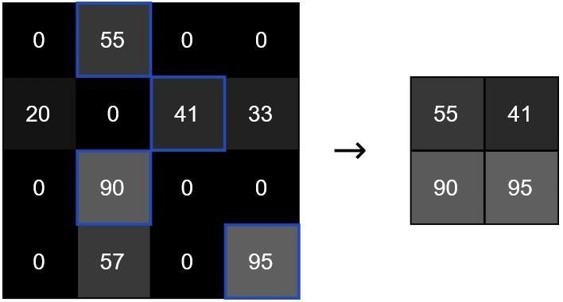
在反向传播过程中，首先，考虑对于 2x2 数据块中不是最大值的输入像素，显然，将不会对**Loss**函数有任何影响，所以$\begin{align} \frac{\partial{L}}{\partial{input}} = 0\end{align}$；而对于最大值像素，$\begin{align}\frac{\partial{out}}{\partial{input}} = 1\end{align}$，因此，$\begin{align} \frac{\partial{L}}{\partial{input}} = \frac{\partial{L}}{\partial{out}}\end{align}$。
综上所述，$\begin{align} \frac{\partial{L}}{\partial{input}} = {\begin{cases} 0, & if \ \ input \neq max \\ \frac{\partial{L}}{\partial{out}} &if \ \ input = max \end{cases}}\tag{29}\end{align}$
整个过程如下图所示：
			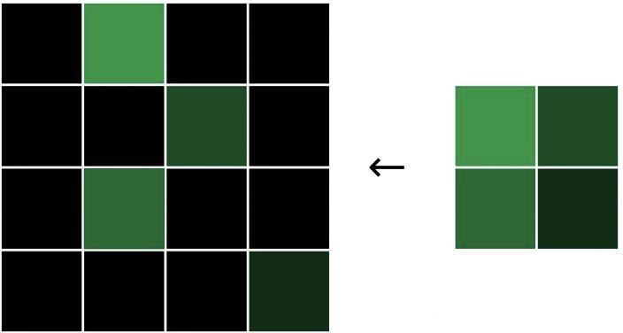
其中，对于非最大值部分，我们选择进行补0操作。
#### 5.4卷积层

考虑卷积层的卷积运算方式：
  1. 将**filter**叠加在图片的顶部，一般从左上角开始，然后执行对应元素的相乘；
  2. 将相乘的结果进行求和，得到输出图片的目标像素值；
  3. 重复以上操作，直到所有的位置。
由于在本项目中，尽管多个卷积层的输入输出形式不太相同，但是卷积运算方式均是单层卷积核对单层输入做卷积运算，因此反向传播的计算方式是相同的。
下面考虑具体的卷积运算：
比如如下图所示时，根据图中当**weight**的值，卷积运算的结果为80：
			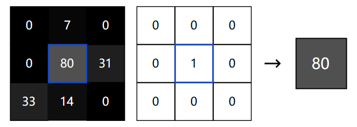

表达为数学形式：
$\begin{align} out(i, j) &= conv(image, filter) \\ &= \sum_{x=0}^{3}\sum_{y=0}^{3} image(i+x, j+y) \ast filter(x, y)\tag{30}\end{align}$
$\begin{align}\frac{\partial{out(i,j)}}{\partial{filter(x, y)}} &= image(i+x, j+y) \tag{31}\\ \frac{\partial{L}}{\partial{filter(x, y)}} &=\sum_i \sum_j \frac{\partial{L}}{\partial{out(i, j)}} \ast \frac{\partial{out(i,j)}}{\partial{filter(x, y)}} \tag{32}\end{align}$

对于本项目的卷积层，在进行卷积运算前均会进行**Padding**，以保证卷积运算前大小不变，由(30)、(31)、(32)得，实际上表达成数学形式：
$\begin{align} out(i, j) &= conv(image, filter) \\ &= \sum_{x=0}^{3}\sum_{y=0}^{3} image(i+x-1, j+y-1) \ast filter(x, y)\tag{33}\end{align}$
$\begin{align}\frac{\partial{out(i,j)}}{\partial{filter(x, y)}} &= image(i+x-1, j+y-1) \tag{34}\\ \frac{\partial{L}}{\partial{filter(x, y)}} &=\sum_i \sum_j \frac{\partial{L}}{\partial{out(i, j)}} \ast \frac{\partial{out(i,j)}}{\partial{filter(x, y)}} \tag{35}\\ &=\sum_i \sum_j \delta(i, j) \ast image(i+x-1, j+y-1)\tag{36}\end{align}$
整个过程实际上是将$input$进行**Padding**，然后裁剪成卷积核大小，与对应位置的 $\delta$进行卷积运算，最后将所有的结果求和。

由于项目中共有三层卷积层，需要计算$Loss$对于$input$的**gradient**：
$\begin{align} \frac{\partial{L}}{\partial{input(x,y)}} &= \sum_i \sum_j \frac{\partial{L}}{\partial{out(i,j)}} \ast \frac{\partial{out(i,j)}}{\partial{input(x,y)}} \\ &= \sum_i \sum_j \delta(i,j) \ast  \frac{\partial{out(i,j)}}{\partial{input(x,y)}} \tag{37}\end{align}$
考虑项目中的卷积运算，显然，
$\begin{align}if\ \ (i < x -2 \vee  i > x+2 )\vee (j < y - 2 \vee j > y +2),\ \ \frac{\partial{out(i,j)}}{\partial{input(x,y)}} = 0 \tag{38}\end{align}$
$\therefore\begin{align} \frac{\partial{L}}{\partial{input(x,y)})} = \sum_{i = x- 2}^{x+2}\sum_{j=y-2}^{y+2} \delta(i,j) \ast \omega(i - x + 3, j -y + 3)\tag{39}\end{align}$
由上式可以看出，$Loss$对于$input$的**gradient**计算过程，是将$\omega$旋转$180^{\circ}$，然后作卷积核与$Loss$对于$out$的**gradient**进行卷积运算，但是本项目先对输入进行**Padding**，因此，也需要对$\frac{\partial{L}}{\partial{out}}$进行**Padding**。

### 6.BatchNormalizaton
### 6.1BatchNormalizaton
Batch Normalization的过程很简单。假定输入是一个大小为$N$的mini-batch $x_i$ ，通过下面的四个式子计算得到的$y$就是**Batch Normalization(BN)** 的值。
$\begin{align}  \mu &= \frac{1}{N}\sum_{i=1}^N x_i   \tag{40} \\ \sigma^2 &= \frac{1}{N} \sum_{i=1}^N (x_i- \mu)^2 \tag{41}\\ \hat{x_i} &= \frac{x_i- \mu}{\sqrt{\sigma^2+\epsilon}} \tag{42}\\ y_i &= \gamma \cdot \hat{x_i} +\beta \tag{43}\end{align}$
首先，由(40)和(41)得到mini-batch的均值和方差，之后进行(42)的归一化操作，在分母加上一个小的常数是为了避免出现除0操作，最后(40)再对$\hat{x_i}$进行以此线性变换得到**BN**的结果。整个过程中只有最后(40)引入了额外参数$\gamma$和$\beta$,两者的大小为特征长度，与$x_i$相同。

### 6.2BN反向传播
我们先画出BN的计算图，其中$x\_$代表$\hat{x}$。
			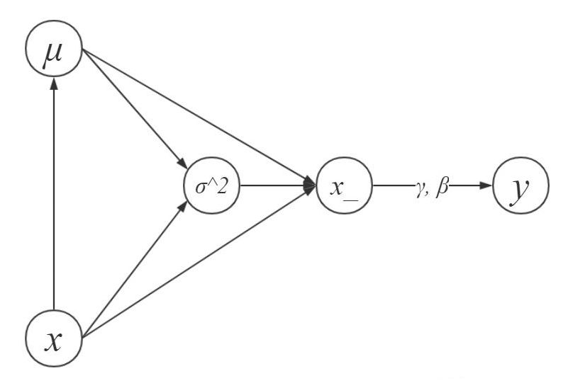
假定损失函数为L，已知L相对于$y_i$ 的偏导$\begin{align}\frac{\partial{L}}{\partial{y_i}}\end{align}$ ，求 $\begin{align}\frac{\partial{L}}{\partial{\gamma}}、\frac{\partial{L}}{\partial{\beta}}、\frac{\partial{L}}{\partial{x_i}}\end{align}$：
首先，前两个式子可以直接求出：
$\begin{align} \frac{\partial{L}}{\partial{\gamma}} &= \sum_{i=1}^N \frac{\partial{L}}{\partial{y_i}} \ast \hat{x_i}\tag{44}\\ \frac{\partial{L}}{\partial{\beta}} &= \sum_{i=1}^N \frac{\partial{L}}{\partial{y_i}} \tag{45}\\ \frac{\partial{L}}{\partial{\hat{x_i}}} &= \frac{\partial{L}}{\partial{y_i}} \ast \gamma \tag{46}\end{align}$
从计算图和(42)中可以看出，要求$\begin{align}\frac{\partial{L}}{\partial{x_i}}\end{align}$ ，要分成$\hat{x_i}、\mu、\sigma^2$三部分来求。
$\begin{align} \frac{\partial{L}}{\partial{x_i}} = \underbrace{\frac{\partial{L}}{\partial{\hat{x_i}}} \cdot \frac{1}{\sqrt{\gamma^2 + \epsilon}}}_{derivative \ of \ x} + \underbrace{\frac{\partial{L}}{\mu} \cdot \frac{\partial{\mu}}{\partial{x_i}}}_{derivative \ of \ \mu} + \underbrace{\frac{\partial{L}}{\partial{\sigma^2}}\cdot \frac{\sigma^2}{x_i}}_{derivative \ of \ \sigma^2}\tag{47}\end{align}$
接下来求$\begin{align}\{\frac{\partial{L}}{\mu}, \frac{\partial{mu}}{\partial{x_i}}, \frac{\partial{L}}{\partial{\sigma^2}}, \frac{\partial{\sigma ^2}}{\partial{x_i}} \}\end{align}$。

$\begin{align} \frac{\partial{L}}{\partial{\mu}} & = \sum_{i=1}^N \frac{\partial{L}}{\partial{\hat{x_i}}} \cdot \frac{-1}{\sqrt{\sigma ^2 + \epsilon}} + \frac{\partial{L}}{\partial{\sigma^2}} \cdot \frac{\partial{\sigma^2}}{\partial{\mu}} \tag{48} \\ \frac{\partial{\mu}}{\partial{x_i}} &= \frac{1}{N} \tag{49} \\ \frac{\partial{L}}{\partial{\sigma^2}} &= \sum_{i=1}^N \frac{\partial{L}}{\partial{\hat{x_i}}} \cdot (x_i - \mu) \cdot \frac{-(\sigma ^2 + \epsilon) ^ {-3/2}}{2}\tag{50}\end{align}$

其中式(49)可以由式(40)直接得到，式(50)是通过链式法则得到的。
由式(41)可得：
$\begin{align} \frac{\partial{\sigma^2}}{\partial{\mu}} = -\frac{\sum_{i=1}^N2(x_i- \mu)}{N} \tag{51}\end{align}$

最后，还需要求出方差的导数：
$\begin{align} \frac{\partial{\sigma^2}}{\partial{x_i}} &= \frac{1}{N}\cdot \sum_{j=1}^N2(x_j- \mu) \frac{\partial{(x_j-\mu)}}{\partial{x_i}}\\ &= -\frac{1}{N}\sum_{j=1}^N 2(x_j-\mu) + \frac{1}{N}2(x_i-\mu)\\ &= \frac{2(x_i-\mu)}{N} \tag{52}\end{align}$

综上：
$\begin{align} \frac{\partial{L}}{\partial{x_i}} = \frac{\partial{L}}{\partial{\hat{x_i}}} \cdot \frac{1}{\sqrt{\sigma^2+\epsilon}} + \frac{\partial{L}}{\partial{\mu}} \cdot \frac{1}{N} + \frac{\partial{L}}{\partial{\sigma^2}}\cdot \frac{2(x_i-\mu)}{N} \tag{53}\end{align}$

进一步化简可得：
$\begin{align} \frac{\partial{L}}{\partial{x_i}} = \frac{1}{N \cdot \sqrt{\sigma^2 _ \epsilon}}[N \frac{\partial{L}}{\partial{\hat{x_i}}}- \sum_{j=1}^N \frac{\partial{L}}{\partial{\hat{x_i}}}- \hat{x_i}\sum_{j=1}^N \frac{\partial{L}}{\partial{\hat{x_j}}}\cdot \hat{x_j} ]\tag{54}\end{align}$

## 结果与分析
在训练的过程中，我们先后加入了**dropout**和**Batch Normalization(BN)**，目的是为了防止出现过拟合和加快训练速度，其中**BN**的效果最为明显，因此，以下主要分析有**Batcn Norm**层的模型，如图2所示：
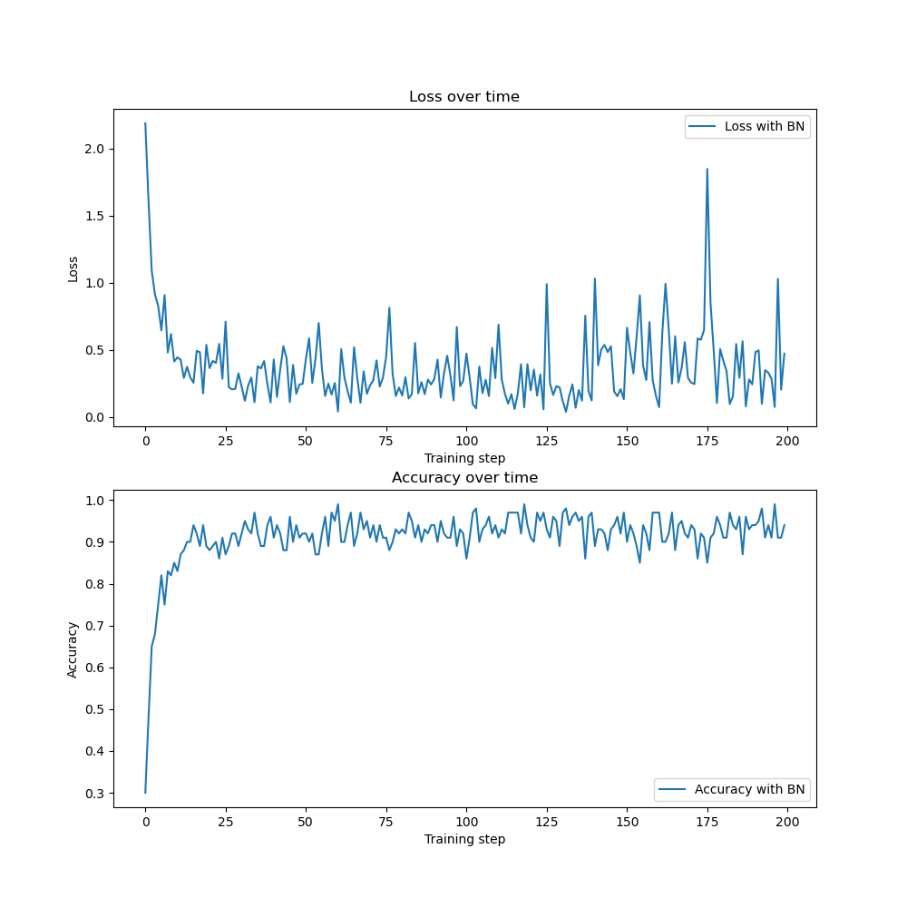
图中损失函数的值为每一百个输入的平均损失，即在前向传播过程中，模型每输入100个数据，所得损失函数值的总和除以100；准确率为每一百个输入的平均准确率，即在前向传播过程中，每100个输入，模型预测正确的个数之和除以100。
由于计算速度所限，训练集为**train.csv**文件中前10000位，测试集为**train.csv**文件中的第11000-12000位，**epochs**为2次。
可以看到随着测试数据的不断增加，平均损失函数的值成明显下降的趋势，平均准确率也逐渐上升、当输入数据规模到达一定时，损失函数值和平均准确率去出现了在一定范围内波动的现象。

另外，对比没有加入**Batch Norm**层的模型，损失函数值下降得不如有**Bacth Norm**层快，准确率也上升得更慢，如图3所示：
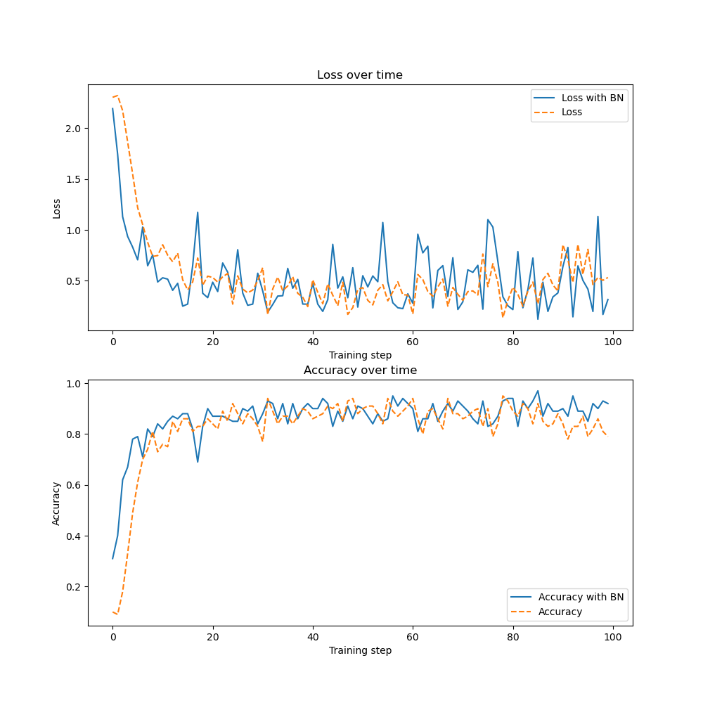
可以看出，**BN**正则化对训练速度的提高是明显的。
因此，最终我们选择有**Batch Norm**层的模型来预测**test.csv**文件中的数据，经过训练后便可以得到不错的结果：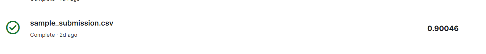
最后，根据查找的资料和经验，可以通过增加卷积层、全连接层或者创建几个神经网络，让他们投票来决定最好的分类，组成一个组合网络，来提高模型预测的准确率。

## 个人体会
之所以会选择用CNN来实现，是因为我问我西交钱院人智专业的同学哪个好做，他跟我说这个比较好做，然后跟我推荐，叫我去实现AlexNet。当时我并没想起这个模型，后面实现的过程中才意识到这是当时最后一节课介绍过的模型，然后知乎上面找了半天怎么用python实现，但是无一不是用诸如pytorch、keras、tensorflow等等被禁止使用的库，顿时感觉自己被坑了。后来退而求其次，查找实现CNN的文章或者视频，尽管现在来看，那篇文章提到有关CNN内容十分简单，仅仅只有一个卷积层、一个池化层和一个输出层，但确实从中获得了不少的启发，于是在五一假期摸索着如何实现AlexNet。
当时，在实现前向传播的过程中，最麻烦的应该是卷积层，因为AlexNet一共有5层卷积层，并且每一层都会进行池化，而我们的数据集中每张图片的大小为28x28，因此在第三层之后卷积层中没加入池化层。而在实现卷积层的过程中，由于最开始时，并没有想到将输入变成三维张量，而是将输入转换为28x28的矩阵，而在之后的卷积层，输入均为三维张量，因此又重新设计一个卷积层，这在1.2部分已经提到过。
其次，在实现反向传播的过程中，最麻烦的也是卷积层，那篇CNN没有提到如何计算损失函数对输入的梯度(这个是最麻烦的)。后面去知乎找有关的文章，结果大多都是叙述繁琐、计算过程很难看，后来，根据之前计算其他的参数的方法，对比前向传播，得到了一个需要分类讨论的式子，当时灵光一现，突然想到可以将卷积核旋转$180^{\circ}$，然后将输出也进行padding，便可以得到一个与正向传播一样的过程，后面也照着这个方法实现了其他几个卷积层的反向传播，只是略微复杂了一些。最开始时，在第二层设置的卷积核为三维张量，深度为8，但是最后在训练的过程中训练速度特别慢，输入1000个数据无法看到准确率明显上升，以为是我写错了，经过多次检查并没发现什么错误，后来索性不管了，在一旁玩手机，结果发现当输入规模达到3000多的时候出现了明显上升，于是一想，可能是因为整个模型的参数过多，一时半会儿参数调节不过来，然后减少了卷积层的层数，但是当输入规模达到10000时，途中经常出现准确率先上升后下降、最后准确率在10%上线浮动的情况，于是修改了三维卷积的运算方式，将三维变为二维，每一个二维卷积核都与一层输入进行卷积运算，修改之后准确率有所上升，也就再没出现那种情况了。
之后，对照AlexNet，加入了**dropout**，尽管确实可以降低过拟合的风险，但是训练速度比较慢，而且一旦学习率比较高(大于0.01)，softmax就会出现溢出，而降低学习率又会使得训练缓慢，陷入了两难的局面。
然后，我在知乎上面找了一些优化的方法，其中有谈到加入L2正则化，而在我了解L2正则化的过程中，了解到了Batch Normaliztion，正好可以很好的解决刚才的问题，花了一些时间学习了解，觉得这个方法真的非常好，加入到网络结构中，效果很明显。
这便是差不多两个星期的学习过程，总的来说，我学到了不少东西，也很好的提高了我对深度学习的了解，锻炼了我的编程水平。途中遇到了不少的问题，也解决了一部分。但是受限于cpu计算，尽管我在中途也尝试用gpu加速计算，但是没能很好地解决遇到的问题，模型的训练是不够的，同时由于我也几乎是从零开始学习深度学习，在之中因为没能有更多的时间，有很多设想没能实现，比如，可以通过建立组合网络，创建几个神经网络，让他们投票来决定最好的分类，类似于随机森林或者adaboost的集成方法。
如果当时能解决好gpu计算的问题的话，搭建AlexNet并不困难。
最后，由衷地觉得，反向传播算法和Batch Normalization真是非常棒的设计。

## 参考文献

1. 斋藤康毅. 深度学习入门：基于Python的理论与实现: 第5章、第6章，人民邮电出版社, 2018 
2. [Victor Zhou. CNNs, Part 1: An Introduction to Convolutional Neural Networks ](https://victorzhou.com/blog/intro-to-cnns-part-1/#6-conclusion)
3. [ Victor Zhou. CNNs, Part 2: Training a Convolutional Neural Network ](https://victorzhou.com/blog/intro-to-cnns-part-2/)
4. [Batch Normalization: Accelerating Deep Network Training by Reducing Internal Covariate Shif]([arxiv.org](https://arxiv.org/pdf/1502.03167v3.pdf)
5. [Understanding the backward pass through Batch Normalization Layer (kratzert.github.io)](https://kratzert.github.io/2016/02/12/understanding-the-gradient-flow-through-the-batch-normalization-layer.html)